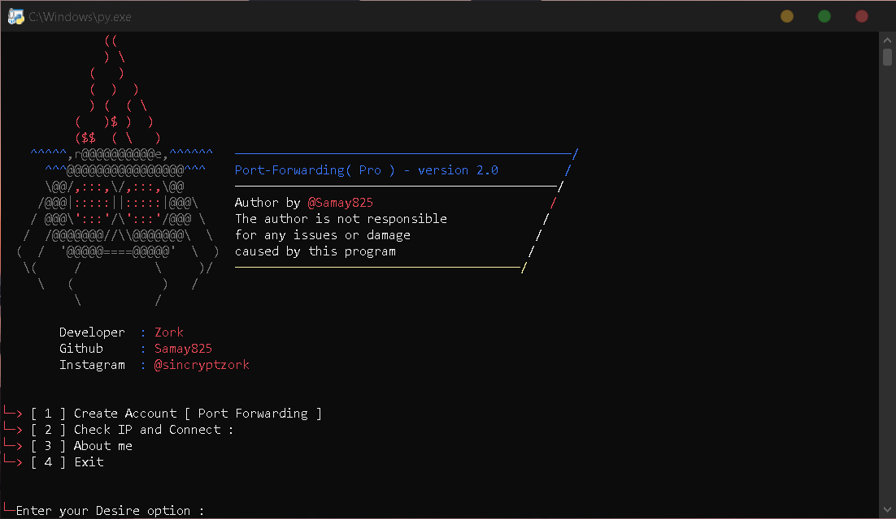

# Static-IP-Automation Script 
 

- Ini adalah generator ip Statis permanen yang menghasilkan tcp ip dan port. 
> Banyak kali Anda hanya ingin memata-matai permanen dengan spynote atau spynote dengan ip ini Anda bisa. 
> Jika Anda menemukan diri Anda dalam situasi itu maka Otomasi Statis-ip ini adalah alat yang sempurna untuk Anda! Anda dapat menghubungkan ip dengan 1 detik. 
> Skrip yang luar biasa ini bekerja dengan setiap operator/operator. 
> alat ini dibuat oleh @samay825 

 

- Static-IP Automation Version features 

* `Creates Your personal account permanent.`

* `Supports newest Android also but script works only in windows.`

* `Instant Tcp connection 1secs.`

* `Working with all Operators/Carriers.`

* `No missing IP issues, all Tcp connection will be persistence.`

*  For Contact Instagram me: sincryptzork

 

- Support

> `Windows only for linux just wait..`

> `Works in all windows only requires python3.`

> `ffbonline.com and more threads.`
 
  

- Installation & Step's
 
> `apt update && apt upgrade`
 
> `git clone https://github.com/Mursin-Doankk/ip-static.git`
 
> `cd Static-IP-Automation`  

> `notice : windows must be little bit fast`
 
> `python3 main.py`

 

<h3>Visitors :</h3>
 

